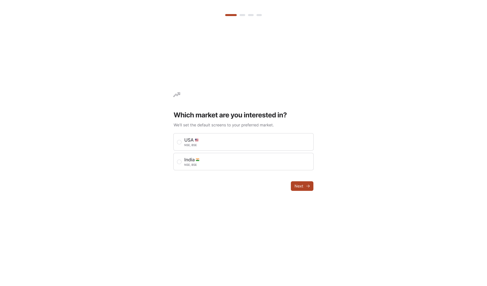
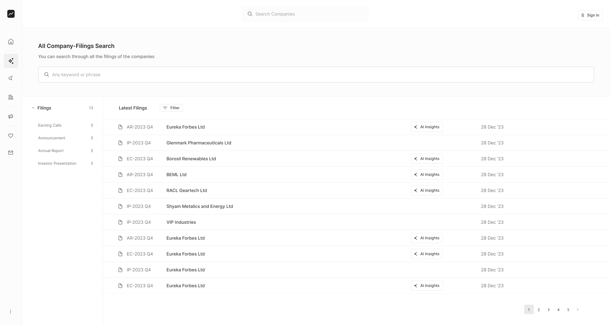

### Signing Up

Signing up for stockinsights.ai is quick and easy. Simply visit our website and click on the "Sign Up" button. You'll be prompted to enter your email address, and a verification link will be sent to your email to confirm your account. Click on the link in the email, and you're all set to start exploring the platform!

### Setting Up Your Profile

After signing up, you'll be prompted to set up your profile and select your market of interest—either US or India. It's essential to choose the one that aligns with your investment focus, as the data and tools specific to the filings will vary accordingly. You can always navigate to the "Profile" section to update your personal information and preferences in the future.

## Navigating the Dashboard

Once your profile is set up, you'll be directed to the dashboard, serving as the central hub for all data and tools. The dashboard is segmented into various sections, each facilitating easy access to essential information. Take some time to acquaint yourself with the layout and navigation options to optimize your stockinsights.ai experience.

